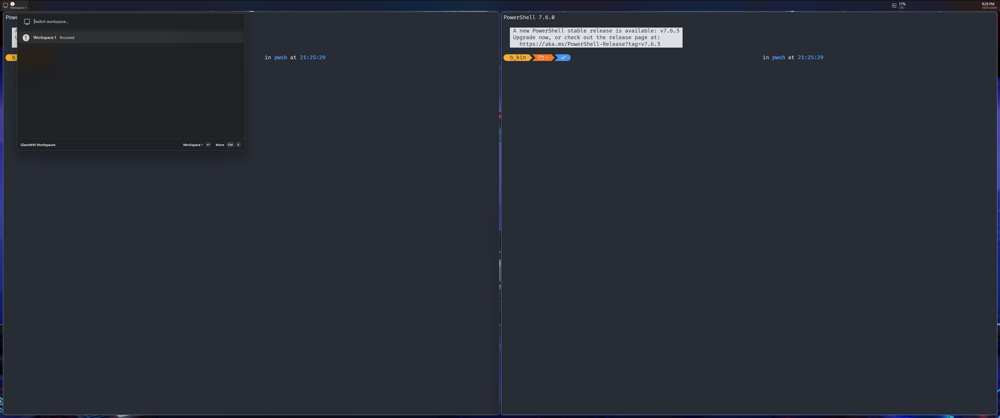

# GlazeWM Workspaces: Command Palette Dock extension

A PowerToys Command Palette extension that shows your GlazeWM workspace numbers
on the Command Palette Dock, the persistent toolbar that reserves screen space
via the Windows AppBar API. It can replace a Zebar workspace strip.

> This is an independent, third-party companion for
> [GlazeWM](https://github.com/glzr-io/glazewm). It is not affiliated with or
> endorsed by the GlazeWM project.

The extension provides two things:

1. A Dock band: the workspace strip rendered as live text on the bar (like the
   built-in clock and CPU widgets), updated as you switch. It's a single band
   whose title text is the strip:
   - focused workspace: filled circled digit (e.g. a heavy ❶-style glyph)
   - active workspace (displayed or holding windows): outline circled digit
   - inactive or empty workspace: plain digit
   - the subtitle spells out the focused workspace, e.g. `3 · 2 windows`.
   - Clicking the strip opens the switcher page (below). GlazeWM's own
     `Alt+1..0` keybinds still do the actual switching.
2. A top-level palette page, "GlazeWM Workspaces", to switch workspaces from the
   palette itself (type, arrow, Enter).

State comes from GlazeWM's IPC WebSocket (`ws://127.0.0.1:6123`). The extension
subscribes to workspace and focus events and re-queries `query workspaces` on
each change.

## Screenshots

<!-- Drop images at docs/images/ and reference them here, e.g.:
     
      -->
_Screenshots coming soon._

---

## Requirements

- Windows 10 version 2004 (build 19041) or later; Windows 11 recommended.
- PowerToys with Command Palette enabled, Command Palette 0.9 / PowerToys 0.98
  or later (the version that adds the Dock / AppBar feature).
- [GlazeWM](https://github.com/glzr-io/glazewm) v3.x (the current release)
  running, with its IPC server enabled on the default port `6123`. The extension
  uses GlazeWM's v3 IPC protocol; earlier v2 builds are not supported.

Both x64 and ARM64 are supported.

---

## Install

### From the Microsoft Store

Once published, install GlazeWM Workspaces from the Microsoft Store or from
Command Palette's built-in extension gallery. Command Palette discovers the
extension automatically after install.

### Build from source

Prerequisites:

- .NET 10 SDK (the project targets `net10.0-windows10.0.26100.0`).
- Visual Studio 2022/2026 with the .NET desktop workload, the Windows 11 SDK
  (10.0.26100), Windows App SDK C# support, and the MSIX Packaging Tools
  component. (Equivalent standalone SDK/build tools also work.)

Package versions are pinned in `Directory.Packages.props` and `.csproj` to match
the official CmdPal extension template
(`Microsoft.CommandPalette.Extensions` `0.11.260520004`). If your installed
Command Palette is a different version, bump that to match.

Visual Studio (recommended):

1. Open `GlazeWMDock.sln`.
2. Set configuration Debug and platform x64 (or ARM64).
3. **Build → Deploy GlazeWMDock**.
   - On first deploy VS creates a self-signed test certificate matching the
     manifest `Publisher` (`CN=GlazeWMDock Dev`) and asks to trust it. Accept.
   - Use Deploy, not just Build. Only Deploy registers the MSIX package so
     Command Palette can discover the extension.
4. In Command Palette, run **Reload** (subtitled *"Reload Command Palette
   Extension"*).

> The (Unpackaged) run profile does not register the extension. Always Deploy
> the package.

CLI alternative (sideload):

```powershell
# Build the signable MSIX layout
dotnet build .\GlazeWMDock\GlazeWMDock.csproj -c Debug -p:Platform=x64 `
  -p:GenerateAppxPackageOnBuild=true -p:AppxPackageSigningEnabled=false
```

Then, from a Developer Command Prompt (so `signtool` is on `PATH`), sign the
produced `.msix` with a self-signed code-signing certificate whose subject
matches the manifest `Publisher` (`CN=GlazeWMDock Dev`), trust that cert once
(import its `.cer` into `Cert:\LocalMachine\TrustedPeople`, elevated), then
install:

```powershell
signtool sign /fd SHA256 /sha1 <your-cert-thumbprint> <path-to>.msix
Add-AppxPackage -Path <path-to>.msix
```

> Enabling Developer Mode (Settings → System → For developers) also lets you
> register the loose build output directly, if you prefer that loop.

#### Updating after code changes

Bump `Version` in `Package.appxmanifest`, rebuild, sign, and re-install. If
install fails with `0x80073D02 … resources it modifies are currently in use`,
Command Palette still has the old COM server running. Stop it, force the update,
then run **Reload** in Command Palette:

```powershell
Get-Process GlazeWMDock -ErrorAction SilentlyContinue | Stop-Process -Force
Add-AppxPackage -Path <new .msix path> -ForceApplicationShutdown
```

---

## Enable the Dock and pin the band

1. Command Palette **Settings → enable Dock**, Position = Top (mirrors a top
   Zebar).
2. Command Palette **Settings → Bands**, toggle GlazeWM Workspaces on. This pins
   the live-text band.
   - Do not use **Pin to Dock** on the top-level GlazeWM Workspaces command. That
     pins the search page, which opens the flyout popup instead of showing text
     on the bar. If you did that, right-click it on the Dock and choose **Unpin**.
3. Switch workspaces (`Alt+1..0`) and watch the strip text update on the bar.
   Click the strip to open the switcher page.

> If the band shows an icon but no text, right-click it in Dock **Edit** mode and
> make sure **Show Titles** (and optionally **Show Subtitles**) is enabled.

---

## Configuration

> Current limitation: there is no settings UI yet. Configuration lives in source
> `const`s, so changing it means editing the code and rebuilding. A Command
> Palette settings form is planned.

- Workspace set: `WorkspaceNames` in `GlazeWMDockCommandsProvider.cs` is
  `"1".."10"`. Edit it to match your GlazeWM `workspaces:` block if you use a
  different set.
- IPC port: `DefaultPort` in `Workspaces/GlazeWmClient.cs` is `6123` (GlazeWM's
  default). Change it if you've moved GlazeWM's IPC port.
- Display mode: the `ShowOnlyActive` constant in
  `Workspaces/WorkspaceStripItem.cs` (default `true`):
  - `true`: hides empty and undisplayed workspaces (Zebar-like). The strip shows
    only what's live: the focused workspace plus any holding windows.
  - `false`: every configured workspace is in the strip; inactive ones (which the
    IPC doesn't tie to any monitor) trail the per-monitor groups as plain digits
    (an i3-style persistent strip).

  The strip re-composes on every workspace change either way.

Because the Dock reserves screen space via the AppBar API, GlazeWM's tiling area
shrinks automatically. Once you switch over you can reduce any `outer_gap` you'd
reserved for a top bar in `~/.glzr/glazewm/config.yaml`.

---

## How it works

State comes from GlazeWM's IPC WebSocket. On connect the extension subscribes to
`focus_changed` and `workspace_*` events, re-queries `query workspaces` on each
change, then re-composes the strip. It auto-reconnects if GlazeWM restarts.

The strip is a single text label rather than one button per workspace because
the Dock renders a band's text from each item's `Title` (bound to a
`TextBlock`). Live text appears on the bar only when it lives in that `Title` and
is mutated in place, which is how the built-in clock band works. Dynamic info in
child items' subtitles only shows inside the flyout popup, never on the bar. So
the whole strip lives in one item's `Title`.

Multi-monitor: the Dock renders the same band on every monitor. The SDK gives an
extension no way to know which monitor a band is painting on (`GetDockBands()`
takes no monitor context), so one strip is unavoidably shared across all docks.
To keep that from looking like every monitor mirrors the same state, the strip
groups workspaces by monitor (ordered left-to-right by physical position, from
`query monitors`). Each monitor's currently displayed workspace is the bold
filled circled digit; every other workspace is a plain digit. Which monitor has
focus is shown by the brackets: every monitor except the one you're on is wrapped
in `[brackets]`, so the un-bracketed group is where you are. So `❸ 5 [1 2 4 ❻]`
reads "I'm on this monitor, showing workspace 3 (which also has 5); the other
monitor is showing 6 (and also has 1, 2, 4)." Switching monitors just moves the
brackets. On a single monitor there are no brackets and it looks the way it
always did.

## Privacy

The extension communicates only with a local GlazeWM instance over loopback
(`ws://127.0.0.1:6123`). It collects no data, sends nothing off the device, and
has no telemetry or analytics. It writes a local, best-effort diagnostic log
(connection status and exception types only, no window titles or personal data)
under the app's `LocalState` folder, rotated at 512 KB.

## Caveats and known limitations

- No true "active" highlight. The Dock renders the strip as a single text label,
  so focus is shown by the glyph (filled vs outline vs plain) inside the text,
  not a colored pill. Visual fidelity is lower than a custom Zebar widget.
- Show Titles must be on. The strip text lives in the band item's `Title`, so it
  only appears with **Show Titles** enabled for the band. The focused-workspace
  detail is in the `Subtitle` (**Show Subtitles**).
- One click target. Because the strip is one label, clicking it opens the
  switcher page rather than focusing a specific workspace. Use GlazeWM's
  `Alt+1..0` keybinds to switch; the strip reflects state.
- Every monitor's dock shows the same strip. The Dock API renders one band
  identically on all monitors, so each dock can't show only its own monitor's
  workspaces. The strip works around this by grouping per monitor and bracketing
  the ones you're not on (see [How it works](#how-it-works)), but the text is the
  same on every dock.
- No auto-hide, no resize or drag. The Dock is always-on and positioned only via
  its setting (Windows AppBar behavior).
- Configuration is compile-time only (see [Configuration](#configuration)).

---

## Publishing

Distribution has two channels: the Microsoft Store (drops self-signing, lists in
Command Palette's gallery) and WinGet (no account needed, discoverable via
CmdPal's *Search WinGet*). Both are documented in
[`docs/publishing-to-store.md`](docs/publishing-to-store.md).

## Troubleshooting the build

This project references only `Microsoft.CommandPalette.Extensions` (matching the
official template); the toolkit base classes (`CommandProvider`, `ListItem`,
`WrappedDockItem`, and so on) ship inside that package. If the build reports
those types as missing, add a matching toolkit reference:

- `Directory.Packages.props`:
  `<PackageVersion Include="Microsoft.CommandPalette.Extensions.Toolkit" Version="0.11.260520004" />`
- `GlazeWMDock.csproj`:
  `<PackageReference Include="Microsoft.CommandPalette.Extensions.Toolkit" />`

If the packaging files give you trouble, the most reliable path is to let
Command Palette generate a guaranteed-building skeleton (**Create a new
extension**, name it `GlazeWMDock`), then copy in the `Workspaces/` folder and
`GlazeWMDockCommandsProvider.cs`. Those plus the provider are the actual work;
the rest is generated boilerplate.

---

## Project layout

```
GlazeWMDock/
  Directory.Build.props          # shared MSBuild props (from template)
  Directory.Packages.props       # central package versions (pinned to 0.11)
  nuget.config
  GlazeWMDock.sln
  GlazeWMDock/
    Program.cs                   # COM-server entry point (from template)
    GlazeWMDockExtension.cs      # IExtension; [Guid] == manifest CLSID
    GlazeWMDockCommandsProvider.cs   # TopLevelCommands + GetDockBands
    Package.appxmanifest         # MSIX + CmdPal extension registration
    app.manifest
    Log.cs                       # best-effort local diagnostic log
    Properties/ ...              # launchSettings + publish profiles
    Assets/ ...                  # MSIX logos
    Workspaces/
      GlazeWmClient.cs           # IPC WebSocket client (query + subscribe)
      WorkspaceInfo.cs           # parsed workspace snapshot
      WorkspaceGlyphs.cs         # state -> glyph mapping
      FocusWorkspaceCommand.cs   # focus --workspace N (used by the page)
      WorkspaceStripItem.cs      # the live-text Dock band (Title = the strip)
      WorkspacesListPage.cs      # top-level palette page + click-through switcher
```

## Contributing

Issues and pull requests are welcome; see [CONTRIBUTING.md](CONTRIBUTING.md).
Please also review the [Code of Conduct](CODE_OF_CONDUCT.md). This project is
built with AI assistance, out in the open; see
[AI_TRANSPARENCY.md](AI_TRANSPARENCY.md).

## License

Released under the [MIT License](LICENSE). GlazeWM is a separate project with its
own license; this extension only communicates with it over a local socket and
does not bundle any GlazeWM code.
